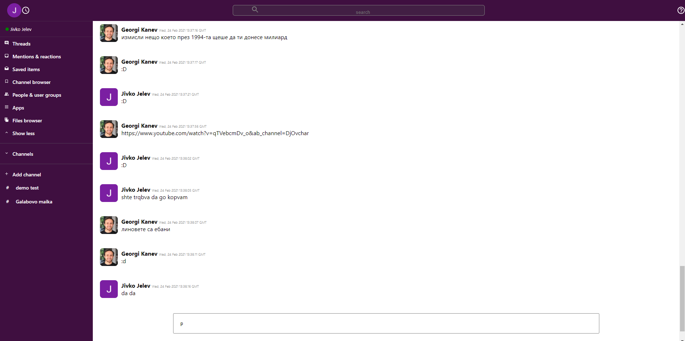

# React Slack Clone

> Simple slack-clone application. Made with React, TypeScript, Redux, Firebase.

> See the demo here: https://slack-clone-c4d97.web.app/




## Features

* 📝 Public chat rooms
* 📡 Realtime sending and receiving of messages
* 💬 Soon: Typing and presence indicators

## Usage

To run the application locally: 
 * Clone the repo
 * Install dependencies
 * Run the app

```
$ git clone https://github.com/JivkoJelev91/react-slack-clone-app.git
$ cd react-slack-clone-app
$ npm install
$ npm start
```

## Note

> :warning: After running the project, note that, firebaseConfig file is missing. 
> Setup your firebase config from https://console.firebase.google.com/
> For more info here: https://firebase.google.com/docs/web/setup
